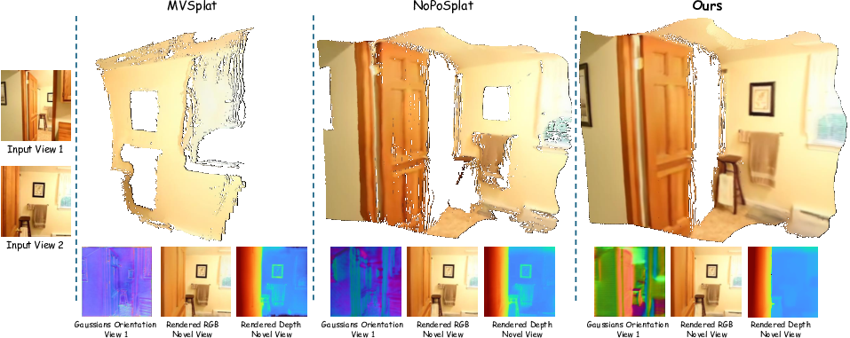

<p align="center">
  <h2 align="center">G<sup>3</sup>Splat
  <br> Geometrically Consistent Generalizable Gaussian Splatting </h2>
 <p align="center">
    <a href="https://m80hz.github.io/" target="_blank">Mehdi Hosseinzadeh</a>
    &nbsp;&nbsp;&nbsp;&nbsp;
    <a href="https://sfchng.github.io/" target="_blank">Shin-Fang Chng</a>
    &nbsp;&nbsp;&nbsp;&nbsp;
    <a href="https://scholar.google.com/citations?user=ldanjkUAAAAJ&hl=en" target="_blank">Yi Xu</a>
    &nbsp;&nbsp;&nbsp;&nbsp;
    <a href="https://researchers.adelaide.edu.au/profile/simon.lucey" target="_blank">Simon Lucey</a>
    &nbsp;&nbsp;&nbsp;&nbsp;
    <a href="https://scholar.google.com.au/citations?user=ATkNLcQAAAAJ&hl=en" target="_blank">Ian Reid</a>
    &nbsp;&nbsp;&nbsp;&nbsp;
    <a href="https://researchers.adelaide.edu.au/profile/ravi.garg" target="_blank">Ravi Garg</a>
  </p>

  <p align="center">
    <!-- Project page badge -->
    <a href="https://m80hz.github.io/g3splat" target="_blank">
      
    </a>
    &nbsp;
    <!-- arXiv badge -->
    <a href="https://arxiv.org/abs/0000.00000" target="_blank">
      
    </a>
    &nbsp;
    <!-- Code badge -->
    <a href="https://github.com/m80hz/g3splat" target="_blank">
      
    </a>
    &nbsp;
    <!-- Hugging Face badge -->
    <a href="https://huggingface.co/m80hz/g3splat" target="_blank">
      
    </a>
  </p>
</p>

<p align="center">
<strong>G<sup>3</sup>Splat</strong> is a pose-free self-supervised framework for generalizable Gaussian splatting that delivers state-of-the-art geometry reconstruction, relative pose estimation, and novel-view synthesis.
</p>
<br>

<p align="center">
  <a href="">
    <!--  -->
    
  </a>
</p>


<br>


## Installation and Environment Setup
Our implementation requires Python 3.10 or later and has been tested with PyTorch 2.1.2 and CUDA 11.8 and 12.1, though it should be compatible with newer PyTorch/CUDA versions as well.

1. Clone G3Splat.
```bash
git clone https://github.com/m80hz/g3splat
cd g3splat
```

2. Create the conda environment (Python 3.10+) and install dependencies.
```bash
conda create -y -n g3splat python=3.10
conda activate g3splat
pip install torch==2.1.2 torchvision==0.16.2 torchaudio==2.1.2 --index-url https://download.pytorch.org/whl/cu118
pip install -r requirements.txt
```

3. Optional, compile CUDA kernels for RoPE positional embeddings to accelerate runtime(as in CroCo v2).
```bash
cd src/model/encoder/backbone/croco/curope/
python setup.py build_ext --inplace
cd ../../../../../..
```

## Checkpoints

Pretrained model weights are available on [Hugging Face](https://huggingface.co/m80hz/g3splat) 🤗.

| Model Variant                                                                                      | Training Resolution | Training Data     |
|:--------------------------------------------------------------------------------------------------:|:-------------------:|:-----------------:|
| [g3splat_grid_normal_re10k.ckpt](https://huggingface.co/m80hz/g3splat/path/to/checkpoint.ckpt)   |        256×256      |   RealEstate10K   |

After downloading, place the checkpoint file(s) in the `pretrained_weights/` directory.  

<!-- ## Camera Conventions
Our camera system is the same as [pixelSplat](https://github.com/dcharatan/pixelsplat). The camera intrinsic matrices are normalized (the first row is divided by image width, and the second row is divided by image height).
The camera extrinsic matrices are OpenCV-style camera-to-world matrices ( +X right, +Y down, +Z camera looks into the screen). -->

## Datasets

For detailed instructions on preparing the datasets, see [DATASETS.md](DATASETS.md).


## Training
First download the [MASt3R](https://download.europe.naverlabs.com/ComputerVision/MASt3R/MASt3R_ViTLarge_BaseDecoder_512_catmlpdpt_metric.pth) pretrained model and put it in the `./pretrained_weights` directory.

Then call `src/main.py` via:

```bash
# Distributed training across 6 nodes (4 GPUs per node) with a batch size of 6 per GPU. To disable WandB logging, simply omit the last two command-line arguments.
python -m src.main +experiment=re10k_grid_normal wandb.mode=online wandb.name=re10k_grid_normal
```
Training was performed on 24× NVIDIA A100 GPUs (40 GB each) with a per-GPU batch size of 6, yielding an effective batch size of 144. The full training run took about 5.6 hours to complete.

You can adjust the per-GPU batch size to match your hardware; however, if you change the overall batch size, you may also need to tweak the initial learning rate to preserve convergence behavior.

Also, we’ve provided several config files in the `config/` directory whose filenames end with `_1x8`—indicating a single-node, single-GPU (NVIDIA A6000, 48 GB) setup.  


# TODO: 

## Depth Evaluation

#### Multi-View (Novel View and Source View) ...

#### Single-View ...

#### Pose Evaluation


## Novel View Synthesis


## Acknowledgements

This project builds upon several fantastic repositories—including [NoPoSplat](https://github.com/cvg/NoPoSplat), [CUT3R](https://github.com/CUT3R/CUT3R), [DUSt3R](https://github.com/naver/dust3r), and [pixelSplat](https://github.com/dcharatan/pixelsplat)—and we extend our thanks to their original authors for their excellent work.  


## Citation

```
@article{xxxx,
    XXXX
    }
```
