# Geometrically-Consistent Generalizable Gaussian Splatting 


## RE10K

<table>
  <thead>
    <tr>
      <!-- <th>Scene</th> -->
      <th>Inputs<br><small>(Source Views)</small></th>
      <th>GS Normal<br><small>Source View 1</small></th>
      <th>Rendered Color<br><small>Novel View</small></th>
      <th>Rendered Depth<br><small>Novel View</small></th>
      <th>GT Color<br><small>Novel View</small></th>
    </tr>
  </thead>
  <tbody>
    <!-- Scene: 0fb6678e63316201 -->
    <tr>
      <!-- <td><code>0fb6678e63316201</code></td> -->
      <td align="center">
        <div>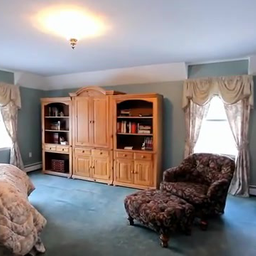<br><sub>Input 1</sub></div>
        <div>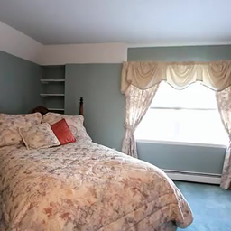<br><sub>Input 2</sub></div>
      </td>
      <td align="center">
        <div>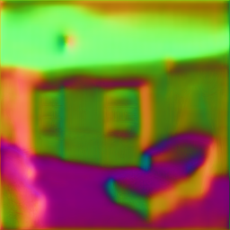<br><sub>Ours</sub></div>
        <div>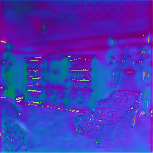<br><sub>NoPoSplat</sub></div>
      </td>
      <td align="center">
        <div>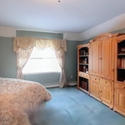<br><sub>Ours</sub></div>
        <div>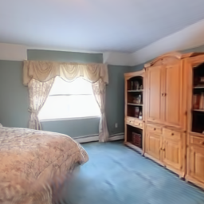<br><sub>NoPoSplat</sub></div>
      </td>
      <td align="center">
        <div>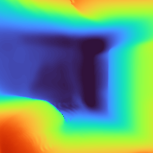<br><sub>Ours</sub></div>
        <div>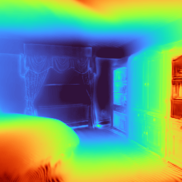<br><sub>NoPoSplat</sub></div>
      </td>
      <td align="center">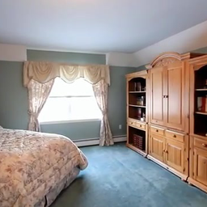<br><sub>GT</sub></td>
    </tr>
    <!-- Scene: 33288d55dde83e72 -->
    <tr>
      <!-- <td><code>33288d55dde83e72</code></td> -->
      <td align="center">
        <div>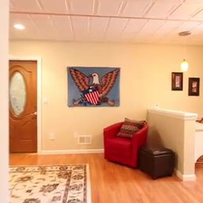<br><sub>Input 1</sub></div>
        <div>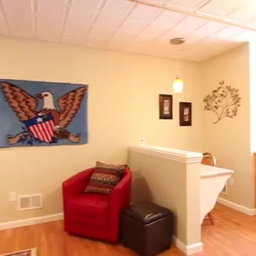<br><sub>Input 2</sub></div>
      </td>
      <td align="center">
        <div>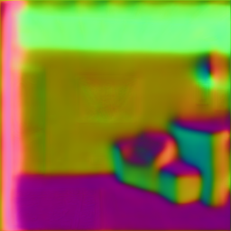<br><sub>Ours</sub></div>
        <div>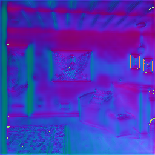<br><sub>NoPoSplat</sub></div>
      </td>
      <td align="center">
        <div><br><sub>Ours</sub></div>
        <div>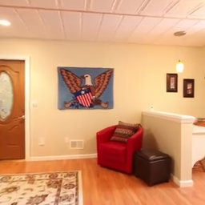<br><sub>NoPoSplat</sub></div>
      </td>
      <td align="center">
        <div>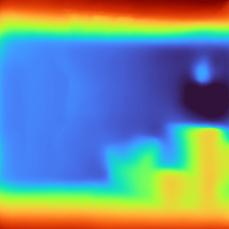<br><sub>Ours</sub></div>
        <div>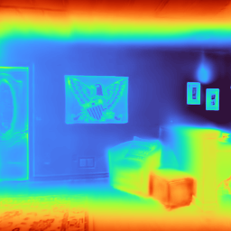<br><sub>NoPoSplat</sub></div>
      </td>
      <td align="center">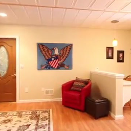<br><sub>GT</sub></td>
    </tr>
    <!-- Scene: aef133f549f40970 -->
    <tr>
      <!-- <td><code>aef133f549f40970</code></td> -->
      <td align="center">
        <div>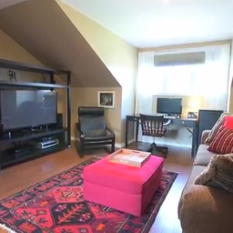<br><sub>Input 1</sub></div>
        <div>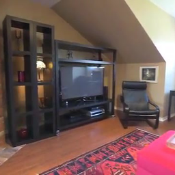<br><sub>Input 2</sub></div>
      </td>
      <td align="center">
        <div>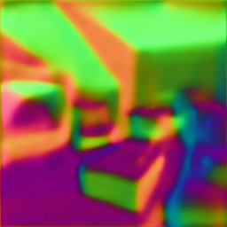<br><sub>Ours</sub></div>
        <div>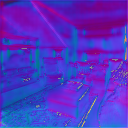<br><sub>NoPoSplat</sub></div>
      </td>
      <td align="center">
        <div>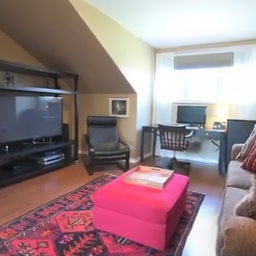<br><sub>Ours</sub></div>
        <div>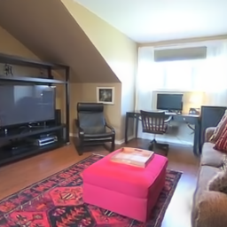<br><sub>NoPoSplat</sub></div>
      </td>
      <td align="center">
        <div>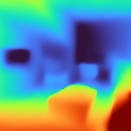<br><sub>Ours</sub></div>
        <div>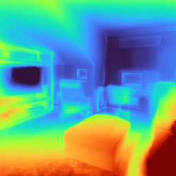<br><sub>NoPoSplat</sub></div>
      </td>
      <td align="center">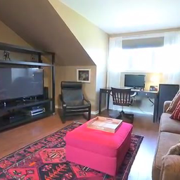<br><sub>GT</sub></td>
    </tr>
  </tbody>
</table>

<!-- <sub>Each comparison cell stacks (top: Ours, bottom: NoPoSplat). Inputs. GT color shown on the right.</sub> -->

### RE10K (Video Comparisons)

<table>
  <thead>
    <tr>
      <!-- <th>Scene</th> -->
      <!-- <th>Variant</th> -->
      <th>Ours</th>
      <th>NoPoSplat</th>
    </tr>
  </thead>
  <tbody>
    <!-- 0fb6678e63316201 RGB -->
    <tr>
      <!-- <td><code>0fb6678e63316201</code></td> -->
      <!-- <td>RGB</td> -->
      <td align="center"><video src="static/videos/ours/re10k/0fb6678e63316201_rgb.mp4" width="240" muted loop playsinline></video></td>
      <td align="center"><video src="static/videos/noposplat/re10k/0fb6678e63316201_rgb.mp4" width="240" muted loop playsinline></video></td>
    </tr>
    <!-- 0fb6678e63316201 Wobble -->
    <tr>
      <!-- <td><code>0fb6678e63316201</code></td> -->
      <!-- <td>Wobble</td> -->
      <td align="center"><video src="static/videos/ours/re10k/0fb6678e63316201_wobble.mp4" width="240" muted loop playsinline></video></td>
      <td align="center"><video src="static/videos/noposplat/re10k/0fb6678e63316201_wobble.mp4" width="240" muted loop playsinline></video></td>
    </tr>
    <!-- 33288d55dde83e72 RGB -->
    <tr>
      <!-- <td><code>33288d55dde83e72</code></td> -->
      <!-- <td>RGB</td> -->
      <td align="center"><video src="static/videos/ours/re10k/33288d55dde83e72_rgb.mp4" width="240" muted loop playsinline></video></td>
      <td align="center"><video src="static/videos/noposplat/re10k/33288d55dde83e72_rgb.mp4" width="240" muted loop playsinline></video></td>
    </tr>
    <!-- 33288d55dde83e72 Wobble -->
    <tr>
      <!-- <td><code>33288d55dde83e72</code></td> -->
      <!-- <td>Wobble</td> -->
      <td align="center"><video src="static/videos/ours/re10k/33288d55dde83e72_wobble.mp4" width="240" muted loop playsinline></video></td>
      <td align="center"><video src="static/videos/noposplat/re10k/33288d55dde83e72_wobble.mp4" width="240" muted loop playsinline></video></td>
    </tr>
    <!-- aef133f549f40970 RGB -->
    <tr>
      <!-- <td><code>aef133f549f40970</code></td> -->
      <!-- <td>RGB</td> -->
      <td align="center"><video src="static/videos/ours/re10k/aef133f549f40970_rgb.mp4" width="240" muted loop playsinline></video></td>
      <td align="center"><video src="static/videos/noposplat/re10k/aef133f549f40970_rgb.mp4" width="240" muted loop playsinline></video></td>
    </tr>
    <!-- aef133f549f40970 Wobble -->
    <tr>
      <!-- <td><code>aef133f549f40970</code></td> -->
      <!-- <td>Wobble</td> -->
      <td align="center"><video src="static/videos/ours/re10k/aef133f549f40970_wobble.mp4" width="240" muted loop playsinline></video></td>
      <td align="center"><video src="static/videos/noposplat/re10k/aef133f549f40970_wobble.mp4" width="240" muted loop playsinline></video></td>
    </tr>
  </tbody>
</table>
<!-- <sub>Row-wise comparison: each variant (RGB / Wobble) shows Ours and NoPoSplat side-by-side.</sub> -->

### RE10K (Meshes & Gaussian Splats)

<table>
  <thead>
    <tr>
      <th>Scene</th>
      <th>Ours Mesh</th>
      <th>NoPoSplat Mesh</th>
      <th>Ours Gaussians</th>
      <th>NoPoSplat Gaussians</th>
    </tr>
  </thead>
  <tbody>
    <tr>
      <td><code>33288d55dde83e72</code></td>
      <td><a href="https://skfb.ly/pBzvB" target="_blank">Ours Mesh</a></td>
      <td><a href="https://skfb.ly/pBzw9" target="_blank">NoPoSplat Mesh</a></td>
      <td><a href="https://superspl.at/view?id=56f8e58f" target="_blank">Ours Gaussian Splats</a></td>
      <td><a href="https://superspl.at/view?id=c78141b5" target="_blank">NoPoSplat Gaussian Splats</a></td>
    </tr>
    <tr>
      <td><code>aef133f549f40970</code></td>
      <td><a href="https://skfb.ly/pBzyp" target="_blank">Ours Mesh</a></td>
      <td><a href="https://skfb.ly/pBzyt" target="_blank">NoPoSplat Mesh</a></td>
      <td><a href="https://superspl.at/view?id=faf08cca" target="_blank">Ours Gaussian Splats</a></td>
      <td><a href="https://superspl.at/view?id=dbfe8217" target="_blank">NoPoSplat Gaussian Splats</a></td>
    </tr>
    <!-- <tr>
      <td><code>0fb6678e63316201</code></td>
      <td><a href="https://skfb.ly/pBzuv" target="_blank">Ours Mesh</a></td>
      <td><a href="https://skfb.ly/pBzuK" target="_blank">NoPoSplat Mesh</a></td>
    </tr> -->
  </tbody>
</table>

## ScanNet

<table>
  <thead>
    <tr>
      <!-- <th>Scene</th> -->
      <th>Inputs<br><small>Source Views</small></th>
      <th>GS Normal<br><small>Source View 1</small></th>
      <th>Rendered Color<br><small>Novel View</small></th>
      <th>Rendered Depth<br><small>Novel View</small></th>
      <th>GT Depth<br><small>Novel View</small></th>
      <th>GT Color<br><small>Novel View</small></th>
    </tr>
  </thead>
  <tbody>
    <!-- Scene: scene0689_00_126_133 -->
    <tr>
      <!-- <td><code>scene0689_00_126_133</code></td> -->
      <td align="center">
        <div>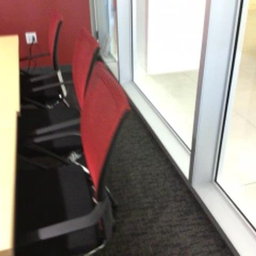<br><sub>Input 1</sub></div>
        <div>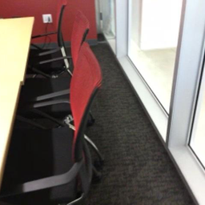<br><sub>Input 2</sub></div>
      </td>
      <td align="center">
        <div>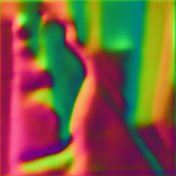<br><sub>Ours</sub></div>
        <div>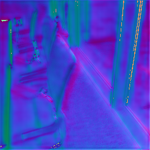<br><sub>NoPoSplat</sub></div>
      </td>
      <td align="center">
        <div><br><sub>Ours</sub></div>
        <div>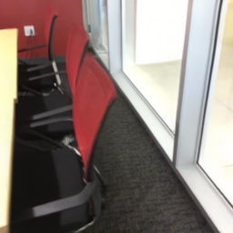<br><sub>NoPoSplat</sub></div>
      </td>
      <td align="center">
        <div>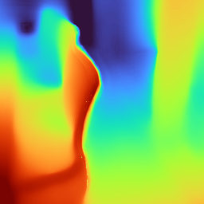<br><sub>Ours</sub></div>
        <div>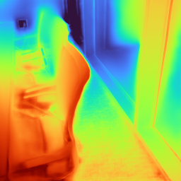<br><sub>NoPoSplat</sub></div>
      </td>
      <td align="center">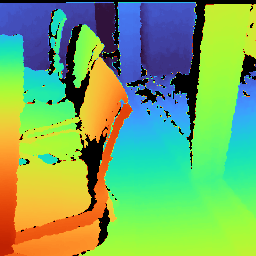<br><sub>GT Depth</sub></td>
      <td align="center">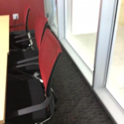<br><sub>GT Color</sub></td>
    </tr>
    <!-- Scene: scene0698_01_305_314 -->
    <tr>
      <!-- <td><code>scene0698_01_305_314</code></td> -->
      <td align="center">
        <div><br><sub>Input 1</sub></div>
        <div>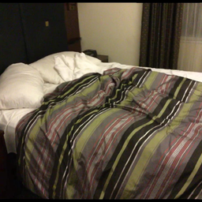<br><sub>Input 2</sub></div>
      </td>
      <td align="center">
        <div>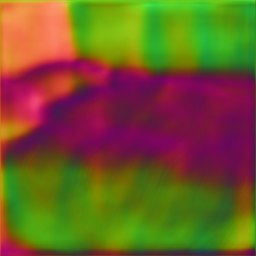<br><sub>Ours</sub></div>
        <div>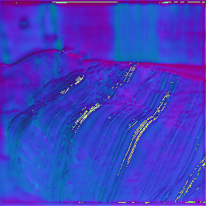<br><sub>NoPoSplat</sub></div>
      </td>
      <td align="center">
        <div>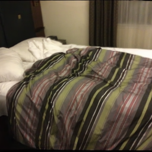<br><sub>Ours</sub></div>
        <div>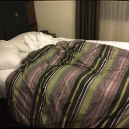<br><sub>NoPoSplat</sub></div>
      </td>
      <td align="center">
        <div>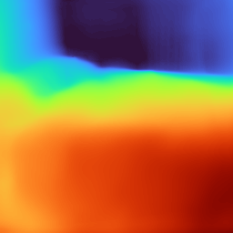<br><sub>Ours</sub></div>
        <div>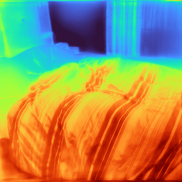<br><sub>NoPoSplat</sub></div>
      </td>
      <td align="center">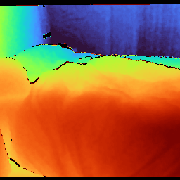<br><sub>GT Depth</sub></td>
      <td align="center">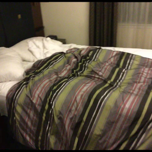<br><sub>GT Color</sub></td>
    </tr>
  </tbody>
</table>

### ScanNet (Meshes & Gaussian Splats)

<table>
  <thead>
    <tr>
      <th>Scene</th>
      <th>Ours</th>
      <th>NoPoSplat</th>
      <th>Ours</th>
      <th>NoPoSplat</th>
    </tr>
  </thead>
  <tbody>
    <tr>
      <td><code>scene0689_00_126_133</code></td>
      <td><a href="https://skfb.ly/pBztw" target="_blank">Ours Mesh</a></td>
      <td><a href="https://skfb.ly/pBztT" target="_blank">NoPoSplat Mesh</a></td>
      <td><a href="https://superspl.at/view?id=39475637" target="_blank">Ours Gaussian Splats</a></td>
      <td><a href="https://superspl.at/view?id=a01f8468" target="_blank">NoPoSplat Gaussian Splats</a></td>
    </tr>
    <tr>
      <td><code>scene0698_01_305_314</code></td>
      <td><a href="https://skfb.ly/pBz9Q" target="_blank">Ours Mesh</a></td>
      <td><a href="https://skfb.ly/pBz9B" target="_blank">NoPoSplat Mesh</a></td>
      <td><a href="https://superspl.at/view?id=f3c7ccb2" target="_blank">Ours Gaussian Splats</a></td>
      <td><a href="https://superspl.at/view?id=c3b8cf43" target="_blank">NoPoSplat Gaussian Splats</a></td>
    </tr>
  </tbody>
</table>

<!-- <sub>ScanNet comparisons include ground-truth depth and color. Each cell stacks Ours (top) and NoPoSplat (bottom).</sub> -->


### ScanNet (Video Comparisons)

<table>
  <thead>
    <tr>
      <!-- <th>Scene</th> -->
      <!-- <th>Variant</th> -->
      <th>Ours</th>
      <th>NoPoSplat</th>
    </tr>
  </thead>
  <tbody>
    <!-- scene0689_00_126_133 RGB -->
    <tr>
      <!-- <td><code>scene0689_00_126_133</code></td> -->
      <!-- <td>RGB</td> -->
      <td align="center"><video src="static/videos/ours/scannet/scene0689_00_126_133_rgb.mp4" width="240" muted loop playsinline></video></td>
      <td align="center"><video src="static/videos/noposplat/scannet/scene0689_00_126_133_rgb.mp4" width="240" muted loop playsinline></video></td>
    </tr>
    <!-- scene0689_00_126_133 Wobble -->
    <!-- <tr> -->
      <!-- <td><code>scene0689_00_126_133</code></td> -->
      <!-- <td>Wobble</td> -->
      <!-- <td align="center"><video src="static/videos/ours/scannet/scene0689_00_126_133_wobble.mp4" width="240" muted loop playsinline></video></td> -->
      <!-- <td align="center"><video src="static/videos/noposplat/scannet/scene0689_00_126_133_wobble.mp4" width="240" muted loop playsinline></video></td> -->
    <!-- </tr> -->
    <!-- scene0698_01_305_314 RGB -->
    <tr>
      <!-- <td><code>scene0698_01_305_314</code></td> -->
      <!-- <td>RGB</td> -->
      <td align="center"><video src="static/videos/ours/scannet/scene0698_01_305_314_rgb.mp4" width="240" muted loop playsinline></video></td>
      <td align="center"><video src="static/videos/noposplat/scannet/scene0698_01_305_314_rgb.mp4" width="240" muted loop playsinline></video></td>
    </tr>
    <!-- scene0698_01_305_314 Wobble -->
    <!-- <tr> -->
      <!-- <td><code>scene0698_01_305_314</code></td> -->
      <!-- <td>Wobble</td> -->
      <!-- <td align="center"><video src="static/videos/ours/scannet/scene0698_01_305_314_wobble.mp4" width="240" muted loop playsinline></video></td> -->
      <!-- <td align="center"><video src="static/videos/noposplat/scannet/scene0698_01_305_314_wobble.mp4" width="240" muted loop playsinline></video></td> -->
    <!-- </tr> -->
  </tbody>
</table>


<!-- ## Placeholder: NVS Results (2 Unposed Views)
Original carousel converted to a simple list of video placeholders. Keep filenames.

| Video | Filename |
|-------|----------|
| Sora 2 | `static/videos/sora2.mp4` |
| Horse | `static/videos/horse.mp4` |
| Barn (AIC swapped) | `static/videos/aic.mp4` |
| AIC (Barn swapped) | `static/videos/barn.mp4` |
| Kitchen | `static/videos/kitchen.mp4` |
| Sora Santorini | `static/videos/sora_santorini.mp4` |
| Church | `static/videos/church.mp4` |
| Family | `static/videos/family.mp4` |

> Later: convert to HTML carousel on the public page.

---

## Quantitative Comparisons (Novel View Synthesis)
Placeholders for metric plots:


Planned table (example schema to fill once numbers are finalized):
```
| Method        | Overlap Low | Overlap Mid | Overlap High | Avg PSNR | Avg SSIM | LPIPS ↓ |
|---------------|-------------|-------------|--------------|----------|----------|---------|
| GeoSplat      | TBD         | TBD         | TBD          | TBD      | TBD      | TBD     |
| Baseline A    | ...         | ...         | ...          | ...      | ...      | ...     |
```

---

## Quantitative Comparisons (Pose Estimation)


Planned metrics: AUC@{5,10,20}, median rotation error, median translation direction error, absolute scale drift (if scale recovered), inlier ratio.

---

## Reconstructed Gaussians (Comparisons)


Viewer links (kept as-is; will swap to GeoSplat assets):
- `compare_ours1.ply` (placeholder link preserved)
- `compare_mvsplat1.ply`
- `compare_pixelsplat1.ply`
- `compare_ours2.ply`
- `compare_mvsplat2.ply`
- `compare_pixelsplat2.ply`

Interpretation note to adapt: Regions with misalignment (magenta / blue arrows in prior template) will be replaced by our own highlight scheme.

---

## Qualitative NVS Comparisons
Group of comparison clips (filenames retained):
```
static/videos/comparisons/re10k_1.mp4
static/videos/comparisons/re10k_2.mp4
static/videos/comparisons/re10k_3.mp4
static/videos/comparisons/re10k_4.mp4
static/videos/comparisons/re10k_5.mp4
static/videos/comparisons/re10k_6.mp4
```
Planned caption: better multi-view fusion, robustness under low overlap, improved unseen region hallucination.

---

## Cross-Dataset Generalization


DTU transfer clips:
```
static/videos/comparisons/dtu_1.mp4
static/videos/comparisons/dtu_2.mp4
static/videos/comparisons/dtu_4.mp4
static/videos/comparisons/dtu_5.mp4
```
ScanNet++ transfer clips:
```
static/videos/comparisons/scannetpp_1.mp4
static/videos/comparisons/scannetpp_2.mp4
static/videos/comparisons/scannetpp_3.mp4
static/videos/comparisons/scannetpp_4.mp4
```

Planned messaging: Canonical-space splat prediction improves zero-shot compositional blending vs pose-required baselines.

---

## In-the-Wild & Additional Examples

### iPhone Photos
Videos / images (placeholders):
```
static/videos/kitchen.mp4  | static/images/kitchen.png
static/videos/aic.mp4      | static/images/aic.png
```

### Sora Generated Images
```
static/videos/sora4.mp4          | static/images/sora_4.png
static/videos/sora_gallery.mp4   | static/images/sora_gallery.png
```

### Tanks & Temples Samples
```
static/videos/museum.mp4   | static/images/museum.png
static/videos/Ignatius.mp4 | static/images/Ignatius.png
```

PLY viewer placeholders (will swap to GeoSplat artifacts): `kitchen.ply`, `aic.ply`, `sora4.ply`, `sora_gallery.ply`, `museum.ply`, `Ignatius.ply`.

---

## Planned Sections To Flesh Out
- Training setup & hyperparameters (batch size scaling, optimizer schedule)
- Loss components (photometric, geometric regularizers, potential depth prior hooks)
- Relative pose estimation refinement stage
- Runtime & memory benchmarks (A100, 4090, laptop GPU)
- Failure cases & limitations

---

## Usage (Link Back To Main README)
For installation, datasets, and training instructions see the root `README.md` (kept authoritative to avoid duplication).

---

## Citation (Placeholder)
```
@article{geosplat2025,
  title   = {GeoSplat: Geometrically-Consistent Generalizable 2D Gaussian Splatting},
  author  = {Hosseinzadeh, Mehdi and Chng, Shin-Fang and Reid, Ian and Lucey, Simon and Garg, Ravi},
  journal = {arXiv preprint arXiv:XXXX.XXXXX},
  year    = {2025}
}
```

> Replace with actual arXiv ID once available.

---

## License
See `LICENSE` (same as repository). External template inspiration acknowledged (original HTML prototype not redistributed here).

---

## Changelog (Draft)
- 2025-09-25: Converted HTML template to Markdown private draft; retained media filenames.

---

## Notes For Future Public Page
- Reintroduce carousels (Bulma / Swiper) only after assets uploaded.
- Add lightweight JS viewer for Gaussian PLY files (or link to external huggingface space variant).
- Replace placeholder metrics with final table exports (auto-generated via evaluation scripts in `scripts/`).
- Ensure accessibility: alt text for all figures; captions beneath video grids.

---

End of draft. -->